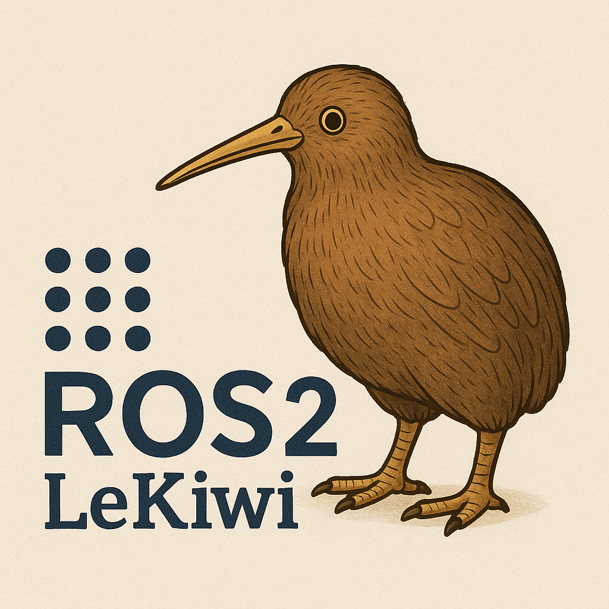

# LeKiwi ROS2 Workspace


This repository contains the a ROS2 workspace/implementation for the LeKiwi robot system. The workspace includes ROS2 implementations of so101 robot arm control (leader and follower), Lekiwi mobile manipulator, ROS2 webcam integration, and a few helper utilities. While this workspace can function as a self-contained "all-you-need" enviornment for controlling your LeKiwi robot in ROS2, I hope it's a jumping off point for pushing your LeKiwi to even bigger and better things.

- Interested in building a LeKiwi? YOU SHOULD BE! Check it out [here](https://github.com/SIGRobotics-UIUC/LeKiwi.git) and get started with this great robot platform.
- Just want a ROS2 wrapper for the SO101 arm? Check out the one we use in this workspace [here](https://github.com/bjblank2/so101_ros2.git) and check out the SO101 repo [here](https://github.com/TheRobotStudio/SO-ARM100.git) or [here](https://github.com/huggingface/lerobot.git)
- Interested in using your ROS2-Powered Lekiwi for ML/Embodied-AI development? OF COURSE YOU ARE! Check out rosetta [here](https://github.com/iblnkn/rosetta.git) and get started integrating your new ROS2 system with [LeRobot](https://github.com/huggingface/lerobot.git). 

## Prerequisites
This tutorial assumes that you are using Ubuntu 24.04 (on a Raspberry Pi 5 or whatever system your LeKiwi is teathered to) [with Docker installed](https://docs.docker.com/engine/install/ubuntu/) an properly configured. Apart from that, all you need is a LeKiwi (obviously), a SO101 leader arm to puppet with, a game controler (X-Box/PS...) to drive the base around, and the IDE of your choice (VS Code and Cursor have both been tested and evertying works nicely).

## Setup Instructions

### 1. Clone the Repository

```bash
git clone <repository-url>
cd lekiwi_ros2_workspace
```

### 2. Build the Container
If you are using VS Code or Cursor, select File->Open Folder and select the le_kiwi_ros2_workspace. After opening the folder, you will be prompted to re-open in a container. Select this option and then you are done.
If you want to do things manually, build the Docker container using the Dockerfile in the `docker/` directory:

```bash
docker build -t ros2_zenoh:latest -f docker/Dockerfile .
```

Or if you need to specify build arguments:

```bash
docker build -t ros2_zenoh:latest -f docker/Dockerfile \
  --build-arg WORKSPACE=/workspaces/lekiwi_ros2_workspace \
  --build-arg USERNAME=ros \
  --build-arg USER_UID=1000 \
  --build-arg USER_GID=1000 \
  .
```

### 3. Update Colcon Mixin

Once inside the container (in your IDE of choice), update the colcon mixin:

```bash
colcon mixin update default
```

This ensures you have the latest build configurations and mixins available.

### 4. Run the Setup Task

Execute the setup script to install dependencies and configure the workspace:

```bash
./scripts/tasks/setup.sh
```

This script will:
- Import repositories from `.repos/src.repos` if it exists
- Update package lists
- Update rosdep
- Install ROS2 dependencies (excluding Python packages handled by pip in the Dockerfile)
- Set up colcon mixins if not already configured

In VS Code or Cursor, you can also hit ctrl+: and select/type setup to run the script.

### 5. Run the Build Task

Build the ROS2 workspace using colcon:

```bash
./scripts/tasks/build.sh
```

This will build all packages in the workspace with the default `rel-with-deb-info` mixin. You can also specify a different mixin:
In VS Code or Cursor, you can also hit ctrl+: and select/type build to run the script.
After building, it is good practice to source the new package in the terminal

```bash
source /install/setup.bash
```

### 6. Launch Zenoh

Zenoh is an amazing tool but getting it to work can be tricky if you are new to its particularities. Be sure to check the "Zenoh Connection Issues" section at the bottom of this README if you are new to zenoh.

Open a new terminal.
In this terminal, ensure the Zenoh RMW implementation is set in your environment. The container should already have this configured, but you can verify:

```bash
export RMW_IMPLEMENTATION=rmw_zenoh_cpp
```

If you need to run a Zenoh router (definetly do if you are running this on a Pi and its good practice in general ), you can launch it separately:

```bash
ros2 run rmw_zenoh rmw_zenohd
```
or

```bash
zenohd
```

For most local setups (you are running everything on your laptop), the embedded RMW implementation is sufficient and no separate daemon is needed.

### 7. Launch Robot Nodes

Launch the required nodes for your robot setup. You can launch them individually or together:
#### To Control your LeKiwi
##### Launch a Game Controler

The LeKiwi base can be controlled ether through a /joy message or a /cmd_vel message.
If you want to use a /joy topic, I recomend opening a new terminal and launching the following node:

```bash
ros2 run joy game_controller_node
```

If you want to control your LeKiwi with a /cmd_vel message launch the following node in a new terminal after launching the game_controller_node:

```bash
ros2 run joy_to_twist joy_to_twist_node
```
This node will subscribe to /joy and publish a new /cmd_vel topic. 

##### Launch a Leader Arm

If you will be puppeting the LeKiwi arm with a SO101 arm (... you will be) open a new tab and launch the following node:
```bash
ros2 launch so101_ros2 so101_leader.launch.py
```

#### Launch the Robot

If you are controlling the LeKiwi base with a /joy message open a new terminal and run:

```bash
ros2 launch lekiwi_ros2 lekiwi_ros2.launch.py
```
If you are instead controlling the LeKiwi base with a /cmd_vel message open a new terminal and run:

```bash
ros2 launch lekiwi_ros2 lekiwi_ros2.launch.py wheel_control_mode:=cmd_vel
```

For the follower arm (if you are just using the so101 and not the Lekiwi mobile manipulator):
```bash
ros2 launch so101_ros2 so101_follower.launch.py
```

#### Launch Webcam Nodes

To launch a webcam node open a new terminal for each webcam and run:
```bash
ros2 launch webcam_ros2 webcam_ros2.launch.py \
    camera_id:=1 \ # replace with the camera id (if not 1)
    topic_name:=front_camera # replace with the desired topic name for the camera
```

#### Launch Helper Nodes
For some ROS2 packages, it is preferable to have the different message types for robot joint states. The joint_state_relay node serves as a translator between these types if needed. For more infermation, see the README for the joint_stat_relay node.

For joint state relay:
```bash
ros2 launch joint_state_relay relay.launch.py
```

## Running the Container Without an IDE
WARNING: This script has been finicky and I am still messing with it. I would recommend against using it until this warning disappears from the README.
To run the container with proper device access, use the provided script:

```bash
./scripts/run.sh
```

This script automatically:
- Mounts the workspace
- Passes through serial devices (`/dev/ttyACM*`, `/dev/ttyUSB*`)
- Passes through joystick devices (`/dev/input/js*`, `/dev/input/event*`)
- Passes through camera devices (`/dev/video*`)
- Sets up X11 forwarding for GUI applications (if not in headless mode)
- Configures the Zenoh RMW implementation

For headless mode (no GUI):
```bash
HEADLESS=1 ./scripts/run.sh
```

## Workspace Structure

- `src/` - ROS2 packages
  - `lekiwi_ros2/` - Main robot control package
  - `so101_ros2/` - SO101 robot arm control package
  - `drivers/webcam_ros2/` - Webcam driver package
  - `utilities/` - Helper utilities (joint_state_relay, joy_to_twist)
- `docker/` - Docker configuration files
- `scripts/` - Setup and build scripts
- `build/` - Build artifacts (generated)
- `install/` - Installation directory (generated)
- `log/` - Build and runtime logs (generated)

## Package Overview

- **lekiwi_ros2**: Main robot control node handling base movement, arm control, and joystick input
- **so101_ros2**: SO101 robot arm driver supporting leader/follower modes
- **webcam_ros2**: Camera driver for webcam integration
- **joint_state_relay**: Utility for relaying joint state messages between different namespaces
- **joy_to_twist**: Joystick to twist message converter (if needed)

## Troubleshooting

### Serial Device Permissions

If you encounter permission errors accessing serial devices, ensure your user is in the `dialout` group (handled automatically in the container).

### Build Errors

If you encounter build errors:
1. Make sure you've run `colcon mixin update default`
2. Ensure all dependencies are installed via `setup.sh`
3. Check that the workspace is properly sourced: `source install/setup.bash`

### Zenoh Connection Issues
Zenoh is an amazing tool but getting it to work can sometimes be tricky for the uninitiated.
If nodes cannot communicate:
1. Verify `RMW_IMPLEMENTATION=rmw_zenoh_cpp` is set
2. For distributed setups, ensure the Zenoh router is running
3. Check network connectivity if using remote Zenoh routers
4. Check that your are using a consistant domain id accross your terminals `echo $ROS_DOMAIN_ID`

If you are using a distributed system (you have your robot nodes running on a Raspberry Pi and your controller nodes running on your laptop) try the following.
- Go to the terminal on each member of your distributed system that is running the zenoh router and kill it ( the zenoh router, not the distributed system).
- In a new terminal run

```bash
export ZENOH_CONFIG_OVERRIDE='connect/endpoints=["tcp/the_ip_of_the_other_distributed_system_you_are_trying_to_reach:7447", "tcp/the_ip_of_any_other_distributed_system_you_need:7447"]'
ros2 run rmw_zenoh_cpp rmw_zenohd
```

- After running this for each member of your distributed system you should be good to go.
  
## Additional Resources

- ROS2 Documentation: [https://docs.ros.org/](https://docs.ros.org/)
- Zenoh Documentation: [https://zenoh.io/](https://zenoh.io/), [https://github.com/ros2/rmw_zenoh.git](https://github.com/ros2/rmw_zenoh.git)
- Colcon Documentation: [https://colcon.readthedocs.io/](https://colcon.readthedocs.io/)

## Coming Soon
Currently working on adding a LeKiwi URDF to fully take advangate of all ROS2 has to offer. Stay tuned...

