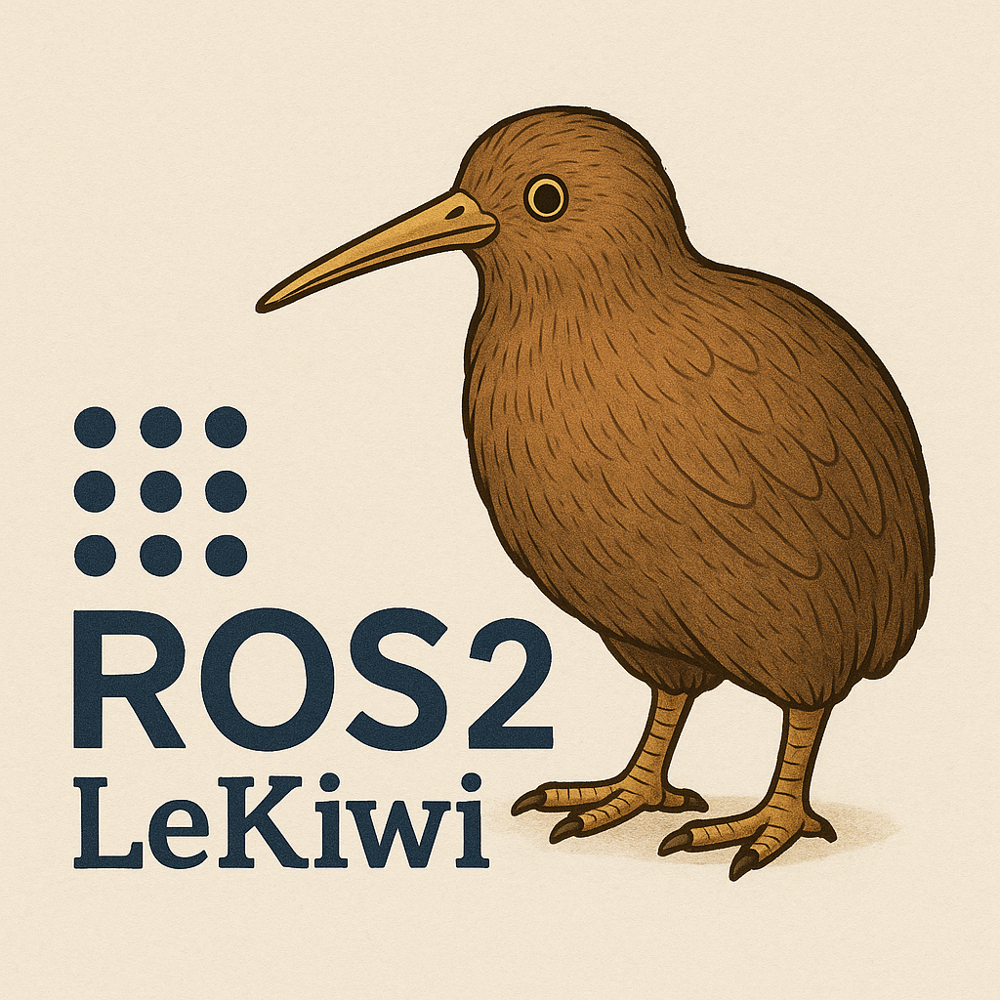

# LeKiwi ROS2 Workspace
<p align="center">
  
</p>


This repository contains a ROS2 workspace/implementation for the LeKiwi robot system. The workspace includes ROS2 implementations of SO101 robot arm control (leader and follower), the LeKiwi omni-wheel mobile manipulator, the LeRRe tracked robot, ROS2 webcam integration, and a few helper utilities. A full ros2_control integration with URDF is included for both robots. While this workspace can function as a self-contained "all-you-need" environment for controlling your LeKiwi robot in ROS2, I hope it's a jumping off point for pushing your LeKiwi to even bigger and better things.

- Interested in building a LeKiwi? YOU SHOULD BE! Check it out [here](https://github.com/SIGRobotics-UIUC/LeKiwi.git) and get started with this great robot platform.
- Just want a ROS2 wrapper for the SO101 arm? Check out the one we use in this workspace [here](https://github.com/bjblank2/so101_ros2.git) and check out the SO101 repo [here](https://github.com/TheRobotStudio/SO-ARM100.git) or [here](https://github.com/huggingface/lerobot.git)
- Interested in using your ROS2-Powered Lekiwi for ML/Embodied-AI development? OF COURSE YOU ARE! Check out rosetta [here](https://github.com/iblnkn/rosetta.git) and get started integrating your new ROS2 system with [LeRobot](https://github.com/huggingface/lerobot.git).

## Prerequisites
This tutorial assumes you are using Ubuntu 24.04 (on a Raspberry Pi 5 or whatever system your LeKiwi is tethered to) [with Docker installed](https://docs.docker.com/engine/install/ubuntu/) and properly configured. Apart from that, all you need is a LeKiwi (obviously), a SO101 leader arm to puppet with, a game controller (Xbox/PS...) to drive the base around, and the IDE of your choice (VS Code and Cursor have both been tested and everything works nicely).

## Setup Instructions

### 1. Clone the Repository

```bash
git clone <repository-url>
cd lekiwi_ros2_workspace
```

> **Note:** Source packages (`lekiwi_ros2`, `so101_ros2`, etc.) are **not** bundled in this repo. They are fetched in Step 3 via `vcstool`.

### 2. Open in the Dev Container

If you are using VS Code or Cursor, select **File → Open Folder** and select `lekiwi_ros2_workspace`. After opening the folder, you will be prompted to re-open in a container. Select this option.

The container's `postCreateCommand` will automatically run `pixi install`, which installs all ROS2 and Python dependencies declared in `pixi.toml` via the [pixi](https://prefix.dev/) conda-based package manager. No manual dependency installation is needed.

If you want to build the container manually:

```bash
docker build -t lekiwi_ros2:latest -f docker/Dockerfile \
  --build-arg WORKSPACE=/workspaces/lekiwi_ros2_workspace \
  --build-arg USERNAME=ros \
  --build-arg USER_UID=1000 \
  --build-arg USER_GID=1000 \
  .
```

### 3. Import Source Repositories

Once inside the container, run the setup script to clone the source packages into `src/`:

```bash
./scripts/tasks/setup.sh
```

Or with the VS Code task runner (`Ctrl+Shift+P` → **Tasks: Run Task** → `setup`).

This script imports all repositories listed in `.repos/src.repos` via `vcstool` and registers the colcon mixin repository on first use. All ROS2 and Python dependencies are already handled by pixi.

### 4. Build the Workspace

Build all packages using pixi's colcon wrapper:

```bash
pixi run build
```

Additional build modes:

```bash
pixi run build-release   # rel-with-deb-info + compile_commands.json
pixi run build-debug     # debug build
```

Or via the VS Code task runner (`Ctrl+Shift+P` → **Tasks: Run Task** → `build`).

After building, source the workspace in any terminal where you want to run ROS2 commands:

```bash
source install/setup.bash
```

### 5. Launch Zenoh

Zenoh is the RMW implementation used in this workspace. The `RMW_IMPLEMENTATION=rmw_zenoh_cpp` environment variable is set automatically by pixi on activation.

If running on a Raspberry Pi or in a distributed setup, start the Zenoh router in a dedicated terminal:

```bash
ros2 run rmw_zenoh_cpp rmw_zenohd
```

For local single-machine setups, the embedded RMW is sufficient and no separate router is needed. See **Zenoh Connection Issues** in the Troubleshooting section if nodes cannot communicate.

### 6. Launch Robot Nodes

---

#### LeKiwi (Omni-Wheel Mobile Manipulator)

There are two launch modes for the LeKiwi:

**Direct servo control** — a single node owns the serial bus and handles both the arm and wheels directly:
```bash
ros2 launch lekiwi_ros2 lekiwi_ros2.launch.py
```

**ros2_control mode** (recommended) — uses a URDF, `controller_manager`, and the `feetech_ros2_driver` hardware interface:
```bash
ros2 launch lekiwi_ros2 lekiwi_ros2_control.launch.py
```

Key arguments for **direct mode** (`lekiwi_ros2.launch.py`):

| Argument | Default | Description |
|---|---|---|
| `port` | `/dev/ttyACM0` | Serial port for the servo bus |
| `baudrate` | `1000000` | Serial baudrate |
| `arm_id` | `follower_arm` | Namespace for the follower arm |
| `leader_arm_id` | `leader_arm` | Namespace of the leader arm to follow |
| `max_relative_target` | `20.0` | Max per-step joint movement (degrees) |
| `wheel_control_mode` | `joy` | `joy` = `/joy` input, `cmd_vel` = `/cmd_vel` input |
| `wheel_count` | `3` | `3` for omni, `4` for mecanum |
| `max_linear_speed` | `1.0` | Max linear speed (m/s) |
| `max_angular_speed` | `2.0` | Max angular speed (rad/s) |
| `axis_linear_x` | `1` | Joystick axis index for forward/back |
| `axis_linear_y` | `0` | Joystick axis index for strafe |
| `axis_angular_z` | `3` | Joystick axis index for rotation |
| `wheel_separation_x` | `0.3` | Wheel separation X (m) |
| `wheel_separation_y` | `0.3` | Wheel separation Y (m) |
| `wheel_radius` | `0.05` | Wheel radius (m) |

Key arguments for **ros2_control mode** (`lekiwi_ros2_control.launch.py`):

| Argument | Default | Description |
|---|---|---|
| `use_joy` | `true` | Launch `joy_node` + `joy_to_twist_node` for gamepad base control |
| `leader_arm_id` | `leader_arm` | Namespace of the leader arm to follow |

In ros2_control mode with `use_joy:=true`, the stack is: gamepad → `/joy` → `joy_to_twist_node` → `/cmd_vel` → `wheel_kinematics_node` → `/wheel_velocity_controller/commands`. To drive from a nav stack or other source instead:
```bash
ros2 launch lekiwi_ros2 lekiwi_ros2_control.launch.py use_joy:=false
# then publish to /cmd_vel
```

---

#### LeRRe (Tracked/Tank Drive Robot)

**Direct servo control**:
```bash
ros2 launch lekiwi_ros2 lerre_ros2.launch.py
```

**ros2_control mode** (recommended):
```bash
ros2 launch lekiwi_ros2 lerre_ros2_control.launch.py
```

Key arguments for **direct mode** (`lerre_ros2.launch.py`):

| Argument | Default | Description |
|---|---|---|
| `port` | `/dev/ttyACM0` | Serial port for the servo bus |
| `baudrate` | `1000000` | Serial baudrate |
| `arm_id` | `follower_arm` | Namespace for the follower arm |
| `leader_arm_id` | `leader_arm` | Namespace of the leader arm to follow |
| `max_relative_target` | `20.0` | Max per-step joint movement (degrees) |
| `wheel_control_mode` | `joy` | `joy` = SpaceMouse input, `cmd_vel` = `/cmd_vel` input |
| `max_linear_speed` | `1.0` | Max linear speed (m/s) |
| `max_angular_speed` | `2.0` | Max angular speed (rad/s) |
| `track_seperation` | `0.2` | Distance between tracks (m) |
| `wheel_radius` | `0.05` | Drive sprocket radius (m) |

> **Note:** In direct mode the `/joy` subscription is remapped to `/spacemouse/joy`, so the default input device is a SpaceMouse. To use a standard gamepad, either remap `/joy` externally or switch to `wheel_control_mode:=cmd_vel` and publish `/cmd_vel` yourself.

Key arguments for **ros2_control mode** (`lerre_ros2_control.launch.py`):

| Argument | Default | Description |
|---|---|---|
| `use_joy` | `true` | Launch `joy_node` + `joy_to_twist_node` for gamepad base control |
| `leader_arm_id` | `leader_arm` | Namespace of the leader arm to follow |

In ros2_control mode with `use_joy:=true`, the stack is: gamepad → `/joy` → `joy_to_twist_node` → `/cmd_vel` → `tank_drive_kinematics_node` → `/track_velocity_controller/commands`.

---

#### Arm Teleoperation (Leader/Follower Puppeting)

Arm teleoperation is **disabled by default** in all launch modes. To puppet the follower arm from a leader arm:

**Step 1** — Launch the SO101 leader arm in a separate terminal:
```bash
ros2 launch so101_ros2 so101_leader.launch.py
```

**Step 2** — Enable arm teleop via the service (same command for both direct and ros2_control modes):
```bash
ros2 service call /follower_arm/set_teleop std_srvs/srv/SetBool "{data: true}"
```

To disable:
```bash
ros2 service call /follower_arm/set_teleop std_srvs/srv/SetBool "{data: false}"
```

The follower mirrors positions from `leader_arm/joint_states`. When enabling, the arm first moves to its current physical position before tracking the leader, preventing sudden jumps.

---

#### SO101 Leader Arm

```bash
ros2 launch so101_ros2 so101_leader.launch.py
```

Key arguments: `port` (default `/dev/ttyACM0`), `arm_id` (default `leader_arm`), `publish_rate` (default `50.0` Hz).

---

#### SO101 Follower Arm (standalone)

If you are using only the SO101 arm without a full robot base:

```bash
ros2 launch so101_ros2 so101_follower.launch.py
```

Key arguments: `port` (default `/dev/ttyACM0`), `arm_id` (default `follower_arm`), `leader_arm_id` (default `leader_arm`), `max_relative_target` (default `20.0` degrees).

---

#### SO101 Hardware-In-the-Loop Teacher

For hardware-in-the-loop teacher mode:

```bash
ros2 launch so101_ros2 so101_hil_teacher.launch.py
```

---

#### Webcam Nodes

Launch a single camera:
```bash
ros2 launch webcam_ros2 webcam_ros2.launch.py \
    camera_id:=2 \
    topic_name:=front_camera
```

To launch multiple cameras from a single node instance, use the list arguments:
```bash
ros2 launch webcam_ros2 webcam_ros2.launch.py \
    camera_ids:="[0, 1]" \
    camera_names:='["front_camera", "back_camera"]'
```

Additional arguments: `frame_rate` (default `30.0`), `width` (default `640`), `height` (default `480`).

---

#### Helper Utilities

**Joy to Twist** — converts `/joy` messages to `/cmd_vel` Twist messages. Configurable axis mapping, speed scaling, dead zones, and input/output topics:

```bash
ros2 run joy_to_twist joy_to_twist_node
```

Key parameters: `axis_linear_x` (default `1`), `axis_linear_y` (default `0`), `axis_angular_z` (default `2`), `max_linear_speed` (default `1.0`), `max_angular_speed` (default `2.0`), `dead_zone` (default `0.1`), `joy_topic` (default `/joy`), `cmd_vel_topic` (default `/cmd_vel`).

**Joint State Relay** — translates joint state messages between namespaces with configurable name remapping, scaling, and offset per joint. Useful for bridging arm joint states to downstream consumers that expect different joint names or orderings:

```bash
ros2 launch joint_state_relay relay.launch.py
```

Configure via `params/relay_leader_to_consumer.yaml`. Key parameters: `input_topic`, `output_topic`, `target_joint_order`, and per-joint `rules.<joint>.source`, `rules.<joint>.scale`, `rules.<joint>.offset`.

---

## Running the Container Without an IDE

To run the container with proper device access, use the provided script:

```bash
./scripts/run.sh
```

This script automatically:
- Mounts the workspace
- Passes through serial devices (`/dev/ttyACM*`, `/dev/ttyUSB*`)
- Passes through joystick devices (`/dev/input/js*`, `/dev/input/event*`)
- Passes through camera devices (`/dev/video*`)
- Sets up X11 forwarding for GUI applications (if not in headless mode)
- Configures the Zenoh RMW implementation

For headless mode (no GUI):
```bash
HEADLESS=1 ./scripts/run.sh
```

## Workspace Structure

```
lekiwi_ros2_workspace/
├── src/
│   ├── lekiwi_ros2/          # LeKiwi and LeRRe robot control (omni + tracked)
│   ├── so101_ros2/           # SO101 arm driver (leader / follower / HIL teacher)
│   ├── drivers/
│   │   ├── feetech_ros2_driver/  # C++ ros2_control hardware interface for Feetech servos
│   │   └── webcam_ros2/          # Webcam driver
│   └── utilities/
│       ├── joint_state_relay/    # Joint state message relay with name/scale/offset mapping
│       └── joy_to_twist/         # /joy → /cmd_vel converter
├── docker/                   # Dockerfile and devcontainer.json
├── scripts/                  # setup.sh and build.sh task scripts
├── .repos/src.repos          # vcstool repository manifest
├── pixi.toml                 # Dependency and task definitions (replaces rosdep/pip)
├── build/                    # Build artifacts (generated)
├── install/                  # Install directory (generated)
└── log/                      # Build and runtime logs (generated)
```

## Package Overview

| Package | Description |
|---|---|
| **lekiwi_ros2** | Robot control for the LeKiwi (omni-wheel) and LeRRe (tracked) platforms. Includes direct-servo and ros2_control launch modes, wheel/track kinematics, arm teleop, and calibration nodes. |
| **so101_ros2** | SO101 arm driver supporting leader, follower, and hardware-in-the-loop teacher modes. |
| **feetech_ros2_driver** | C++ ros2_control hardware interface plugin for Feetech STS/SCS servo series. Used by the ros2_control launch modes. |
| **webcam_ros2** | Camera driver supporting single and multi-camera configurations. |
| **joint_state_relay** | Utility for relaying joint state messages between namespaces with configurable name remapping, scaling, and offset. |
| **joy_to_twist** | Converts `/joy` messages to `/cmd_vel` Twist messages with configurable axis mapping and speed scaling. |

## Troubleshooting

### Serial Device Permissions

If you encounter permission errors accessing serial devices, ensure your user is in the `dialout` group (handled automatically in the container).

### Build Errors

If you encounter build errors:
1. Confirm `pixi install` completed successfully (runs automatically on container creation)
2. Run `./scripts/tasks/setup.sh` to ensure all source repositories are imported
3. Ensure the workspace is sourced: `source install/setup.bash`
4. For C++ build failures in `feetech_ros2_driver`, confirm `libserial` is installed at `/usr/local` (built from source in the Dockerfile)

### Zenoh Connection Issues

If nodes cannot communicate:
1. Verify `echo $RMW_IMPLEMENTATION` returns `rmw_zenoh_cpp`
2. Verify a consistent domain ID across terminals: `echo $ROS_DOMAIN_ID`
3. For distributed setups (robot nodes on Pi, controller nodes on laptop), ensure the Zenoh router is running on each machine

For a distributed system, kill any existing Zenoh routers on each machine and restart with explicit endpoint configuration:

```bash
export ZENOH_CONFIG_OVERRIDE='connect/endpoints=["tcp/<ip_of_other_machine>:7447"]'
ros2 run rmw_zenoh_cpp rmw_zenohd
```

Run this on each machine in the distributed system.

## Additional Resources

- ROS2 Documentation: [https://docs.ros.org/](https://docs.ros.org/)
- ROS2 Control Documentation: [https://control.ros.org/](https://control.ros.org/)
- Zenoh Documentation: [https://zenoh.io/](https://zenoh.io/), [https://github.com/ros2/rmw_zenoh.git](https://github.com/ros2/rmw_zenoh.git)
- pixi Documentation: [https://prefix.dev/docs/pixi/](https://prefix.dev/docs/pixi/)
- Colcon Documentation: [https://colcon.readthedocs.io/](https://colcon.readthedocs.io/)


## Todo:
- The lekiwi_so101_calibration.yaml file uses lerre_ros2_node as its top-level ROS2 parameter key, so the lekiwi_ros2_node (different node name) likely won't receive calibration from it via the parameter server
- Every individual read() call in motors_bus._read() has a hardcoded 5 ms sleep + port flush — adds latency when reading 6+ motors sequentially
- lekiwi_ros2_node.omni3_kinematics divides then immediately multiplies back by wheel_radius, returning m/s rather than rad/s (but apply_wheel_velocities compensates by dividing again, so the final value is correct)
- axis_angular_z default declared as 2 in _declare_parameters but the hardcoded fallback in the getter is 3